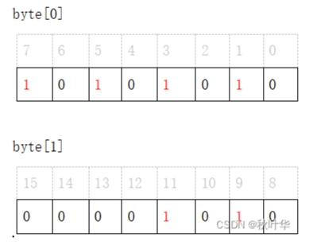

>
>
> Reference: https://en.wikipedia.org/wiki/Bitmap https://blog.csdn.net/u014614478/article/details/121875971
>

## 1、Bitmap

在计算中，位图是从某个域（例如，整数范围）到位的映射。它也称为位数组或位图索引。 (mapping from some domain (for example, a range of integers) to bits)

由于采用了bit为单位来存储数据，因此在存储空间方面，可以大大节省。（节省存储空间）

最基本的情况，使用一个bit表示一个关键字的状态（可标示两种状态0-不存在，1-存在），也可以使用2bit（表示4种状态），3bit（表示8种状态）需要根据业务场景实现。

BitMap 数据结构

数据结构：byte[]，一个byte 8 bit,使用bit为单位来存储数据，可以在空间和时间双重维度提高效率。

注：也可以是 int[],long[],数据结构,分别表示32bit,64bit

数组:[7,9,11,1,3,5]，存储如下图

注:byte[] 下标  n/8 == n >>> 3 即向右位移3位；byte[]值域 1<< n%8 = ( n & 0x07) 即取模向左位移

### Bitmap 应用场景

1.多个超大文件取交集(数字文件)

2.从海量电话号码中，统计不同号码的个数

3.统计日活，访问量，如 redis.setbit('YYYY-MM-DD',Id,1);

4.BitMap处理大量数字型数据的排序、查询、去重

5.BitMap扩展——Bloom Filter(布隆过滤器)过滤数据(id)

#### BitMap 优缺点

#### 优点：

1.运算效率高，不需要进行比较和移位；

2.占用内存少，比如: 20亿/8/1024/1024/1024≈0.232G

3.高效排序，去重，校验o(1)，查询o(n)

4.可删除(存储数值型数据)

#### 缺点：

1.所有的数据不能重复。即不可对重复的数据进行排序和查找。

2.只有当数据比较密集时才有优势

3.数据碰撞。比如将字符串hash映射到 BitMap 的时候会有碰撞的问题，那就可以考虑用 Bloom Filter 来解决，Bloom Filter 使用多个 Hash 函数来减少冲突的概率。

4.数据稀疏。比如要存入(9,55555555,99999999)这三个数据，需要建立一个 99999999/8+1 长度的 BitMap ，但是实际上只存了3个数据，这时候就会很大的空间浪费（少量数据不建议使用）；可以通过引入 Roaring BitMap 来解决。

### BitMap Bloom Filter扩展

Bloom Filter(布隆过滤器)是以BitMap基本原理实现的扩展

布隆过滤器是一个含有 m 个元素的位数组（元素为0或1），每一位初始为0;并含有 k 个独立的哈希函数 h1, h2,..., hk 。

需要将集合中的元素加入到布隆过滤器中，依次计算h1(x), h2(x),...,hk(x)，其计算结果填充对应数组的位置，并将其全部置1。一个位置可以被多次置1，但只有一次有效。

当查询某个元素是否在集合中时，计算这 k 个哈希函数，只有当其计算结果全部为1时，则认为可能存在；只要有1个计算结果为0时，则必不存在。

注:布隆过滤器存在假阳性的可能，即当所有哈希值都为1时，该元素也可能不在集合内，但该算法认为在里面。假阳性出现的概率被哈希函数的数量、位数组大小、以及集合元素等因素决定

#### BitMap Bloom Filter 优缺点与BitMap大致一样

#### 优点：

- 空间效率高，所占空间小。
- 查询时间短。
- 自带去重

#### 缺点：

- 元素添加到集合中后，不能被删除。
- 有一定的误判率

### Cuckoo Filter(布谷鸟过滤器)与布隆过滤器比较

- 支持动态删除项；
- 更好的查找性能；
- 对于需要低假阳性率的应用程序(ϵ<3%)有更好的空间利用率

### BitMap Bloom Filter 使用场景

- 大量数据中判断某个数据是否存在
- 解决缓存穿透
- 爬虫url/ 邮箱等系统的过滤

#### BitMap常用的实现

- Java bitmap
- Redis bitmap

  

