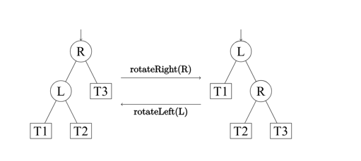

>
>
> Reference: https://en.wikipedia.org/wiki/Binary_tree https://www.jianshu.com/p/8dfe95ee3825 https://oi-wiki.org/ds/rbtree/ https://juejin.cn/post/6844903957563703309
>

### 二叉树(binary tree)

二叉树（英语：Binary tree）是每个节点最多只有两个分支（即不存在分支度大于2的节点）的树结构。通常分支被称作“左子树”或“右子树”。二元树的分支具有左右次序，不能随意颠倒。

二叉树是n个有限元素的集合，该集合或者为空、或者由一个称为根（root）的元素及两个不相交的、被分别称为左子树和右子树的二叉树组成，是有序树。当集合为空时，称该二叉树为空二叉树。在二叉树中，一个元素也称作一个节点

- 节点：包含一个数据元素及若干指向子树分支的信息。
- 节点的度：一个节点拥有子树的数目称为节点的度。
- 叶子节点：也称为终端节点，没有子树的节点或者度为零的节点。
- 分支节点：也称为非终端节点，度不为零的节点称为非终端节点。
- 树的度：树中所有节点的度的最大值。
- 节点的层次：从根节点开始，假设根节点为第1层，根节点的子节点为第2层，依此类推，如果某一个节点位于第L层，则其子节点位于第L+1层。
- 树的深度：也称为树的高度，树中所有节点的层次最大值称为树的深度。
- 有序树：如果树中各棵子树的次序是有先后次序，则称该树为有序树。
- 无序树：如果树中各棵子树的次序没有先后次序，则称该树为无序树。
- 森林：由m（m≥0）棵互不相交的树构成一片森林。如果把一棵非空的树的根节点删除，则该树就变成了一片森林，森林中的树由原来根节点的各棵子树构成。

二叉树的遍历分成三种，按照根节点的访问先后分为： 

- 先序遍历（先根遍历）：先访问根节点，然后访问左子树，最后访问右子树。 
- 中序遍历（中根遍历）：先访问左子树，然后访问根节点，最后访问右子树。 
- 后序遍历（后根遍历）：先访问左子树，然后访问右子树，最后访问根节点

一些不一样的树：

#### 二叉查找树(Binary search tree (BST))

二叉查找树（英语：Binary Search Tree），也称为二叉搜索树、有序二叉树（ordered binary tree）或排序二叉树（sorted binary tree），是指一棵空树或者具有下列性质的二叉树：

若任意节点的左子树不空，则左子树上所有节点的值均小于它的根节点的值；
若任意节点的右子树不空，则右子树上所有节点的值均大于它的根节点的值；
任意节点的左、右子树也分别为二叉查找树；

在二叉查找树b中查找x的过程为：

若b是空树，则搜索失败，否则：
若x等于b的根节点的数据域之值，则查找成功；否则：
若x小于b的根节点的数据域之值，则搜索左子树；否则：
查找右子树。

    Status SearchBST(BiTree T, KeyType key, BiTree f, BiTree &p) {
            // 在根指针T所指二叉查找树中递归地查找其關键字等於key的數據元素，若查找成功，
            // 則指针p指向該數據元素節點，并返回TRUE，否則指针指向查找路徑上訪問的最後
            // 一個節點并返回FALSE，指针f指向T的雙親，其初始调用值為NULL
            if (!T) { // 查找不成功
                p = f;
                return false;
            } else if (key == T->data.key) { // 查找成功
                p = T;
                return true;
            } else if (key < T->data.key) // 在左子樹中繼續查找
                return SearchBST(T->lchild, key, T, p);
            else // 在右子樹中繼續查找
                return SearchBST(T->rchild, key, T, p);
    }

运用：...

#### 平衡二叉树(Balanced BinaryTree) 

平衡二叉树（Balanced Binary Tree）是二叉查找树的一个进化体，也是第一个引入平衡概念的二叉树。 平衡二叉树要求对于每一个节点来说，它的左右子树的高度之差不能超过1，如果插入或者删除一个节点使得高度之差大于1，就要进行节点之间的旋转，将二叉树重新维持在一个平衡状态。

平衡因子：平衡二叉树是在二叉查查找树的基础上进行构建了，为了维持平衡二叉树的平衡，那么就需要一种机制来判断平衡二叉树是否是平衡的。这种机制就叫做平衡因子。平衡二叉树上某个结点的左子树深度减去右子树深度的值，就称为此结点的平衡因子。

最小不平衡树：距离插入结点最近的，且平衡因子的绝对值大于1的结点为根的子树，称为最小不平衡树。

特点:

- 平衡二叉树是一种二叉查找树

- 每个结点的左子树的高度减去右子树的高度的绝对值不超过1

- 空树和左右子树都是平衡二叉树

- 相比红黑树，平衡二叉树比较适用于没有删除的情况

平衡二叉树的每个结点都会维持一个值，这个值就是平衡因子，这个平衡因子就是这个结点的左子树的高度减去右子树的高度得到的值。
如果这个平衡因子的值的绝对值大于1了，说明这个树就不平衡了，那么就需要调整树的结构了。

- 左旋

- 右旋

- 右平衡操作

- 左平衡操作

我们详细的介绍到平衡二叉查找树的算法以及代码实践，我们知道平衡二叉查找树是一个高度平衡的二叉树，也就是说树的高度差不能大于1，在删除的时候，可能需要多次调整，也就是左旋转、右旋转操作，在树的深度很大的情况下，删除效率会非常低，如何提高这种效率？红黑树由此诞生了。

运用：...

#### 平衡二叉树之AVL树(AVL tree)

同平衡二叉树(Balanced BinaryTree)

#### 平衡二叉树之红黑树(Red–black tree)

红黑树是一种特化的AVL树

红黑树是一种自平衡的二叉搜索树。每个节点额外存储了一个 color 字段 ("RED" or "BLACK")，用于确保树在插入和删除时保持平衡。

性质

一棵合法的红黑树必须遵循以下四条性质：

1. 节点为红色或黑色
2. NIL 节点（空叶子节点）为黑色
3. 红色节点的子节点为黑色
4. 从根节点到 NIL 节点的每条路径上的黑色节点数量相同

旋转操作

旋转操作是多数平衡树能够维持平衡的关键，它能在不改变一棵合法 BST 中序遍历结果的情况下改变局部节点的深度。

如上图，从左图到右图的过程被称为右旋，右旋操作会使得 T3 子树上结点的深度均减 1，使 T1 子树上结点的深度均加 1，而 T2 子树上节点的深度则不变。从右图到左图的过程被称为左旋，左旋是右旋的镜像操作。

运用：

由于红黑树是目前主流工业界综合效率最高的内存型平衡树，其在实际的工程项目中有着广泛的使用，这里列举几个实际的使用案例并给出相应的源码链接，以便读者进行对比学习。

Hashmap, ConcurrentHashMap

##### Linux

源码：

- linux/lib/rbtree.c
- 
Linux 中的红黑树所有操作均使用循环迭代进行实现，保证效率的同时又增加了大量的注释来保证代码可读性，十分建议读者阅读学习。Linux 内核中的红黑树使用非常广泛，这里仅列举几个经典案例。

###### CFS 非实时任务调度

Linux 的稳定内核版本在 2.6.24 之后，使用了新的调度程序 CFS，所有非实时可运行进程都以虚拟运行时间为键值用一棵红黑树进行维护，以完成更公平高效地调度所有任务。CFS 弃用 active/expired 数组和动态计算优先级，不再跟踪任务的睡眠时间和区别是否交互任务，而是在调度中采用基于时间计算键值的红黑树来选取下一个任务，根据所有任务占用 CPU 时间的状态来确定调度任务优先级。

###### epoll

epoll 全称 event poll，是 Linux 内核实现 IO 多路复用 (IO multiplexing) 的一个实现，是原先 poll/select 的改进版。Linux 中 epoll 的实现选择使用红黑树来储存文件描述符。

###### Nginx
源码：

- nginx/src/core/ngx_rbtree.h

- nginx/src/core/ngx_rbtree.c

nginx 中的用户态定时器是通过红黑树实现的。在 nginx 中，所有 timer 节点都由一棵红黑树进行维护，在 worker 进程的每一次循环中都会调用 ngx_process_events_and_timers 函数，在该函数中就会调用处理定时器的函数 ngx_event_expire_timers，每次该函数都不断的从红黑树中取出时间值最小的，查看他们是否已经超时，然后执行他们的函数，直到取出的节点的时间没有超时为止

###### ConcurrentHashMap

    ConcurrentHashMap是线程安全的HashMap；在并发的情况下使用HashMap可能会导致死循环，在进行put操作时导致CPU利用率接近100%。是因为在多线程会导致HashMap的Entry链表形成环形数据结构，一旦形成环形数据结构，Entry的next结点永远不能为空，就会产生死循环获取Entry。
    在JDk1.8中ConcurrentHashMap采用Node + CAS + Synchronized来保证并发情况下的更新不会出现问题。其底层的数据结构是：数组 + 链表 + 红黑树 的方式来实现的。

###### ConcurrentHashMap使用红黑树总结

###### HashMap

###### HashMap使用红黑树总结

    java8不是用红黑树来管理hashmap，而是在hash值相同的情况下（且重复数量大于8），用红黑树来管理数据。 红黑树相当于排序数据，
    可以自动的使用二分法进行定位，性能较高。一般情况下，hash值做的比较好的话基本上用不到红黑树。

    红黑树牺牲了一些查找性能 但其本身并不是完全平衡的二叉树。因此插入删除操作效率略高于AVL树。

    AVL树用于自平衡的计算牺牲了插入删除性能，但是因为最多只有一层的高度差，查询效率会高一些。

在jdk1.8之后引入了红黑树的概念，为什么采用6和8进行红黑树和链表转化

    表示若桶中链表元素超过8时，会自动转化成红黑树；若桶中元素小于等于6时，树结构还原成链表形式。
    1）原因：
    　　红黑树的平均查找长度是log(n)，长度为8，查找长度为log(8)=3，链表的平均查找长度为n/2，当长度为8时，平均查找长度为8/2=4，这才有转换成树的必要；链表长度如果是小于等于6，6/2=3，虽然速度也很快的，但是转化为树结构和生成树的时间并不会太短。
    
    2）选择6和8的原因是：
    果是小于等于6，6/2=3，虽然速度也很快的，但是转化为树结构和生成树的时间并不会太短。
    
    2）选择6和8的原因是：
    　　中间有个差值7可以防止链表和树之间频繁的转换。假设一下，如果设计成链表个数超过8则链表转换成树结构，链表个数小于8则树结构转换成链表，如果一个HashMap不停的插入、删除元素，链表个数在8左右徘徊，就会频繁的发生树转链表、链表转树，效率会很低。

#### B树(B-tree)

运用：...

#### B+树(B+ tree)

运用：...

#### B*树(B* tree)

运用：...

#### Trie树(Trie tree)

运用：...
