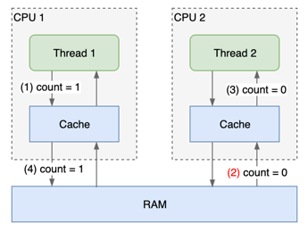

>
>
> Reference: https://lotabout.me/2019/Java-volatile-keyword/ https://www.cnblogs.com/cxy2020/p/12951333.html
>

## 1、Volatile (不稳定的)

### 缓存让读写不确定

由于 CPU 缓存的存在及编译器/CPU 的指令重排，多线程程序的运行结果实际上很难预期，volatile 关键词是 JVM 提供的保证变量“可见性”的武器。JVM 会做许多底层的工作来保证这种可见性。

现代 CPU 有多级缓存，写指令的结果可能“很久”之后才会真正写入内存；同样的，读指令也可能读取的不是最新的值，而是“很久”之前缓存的值。例如对于下面代码：

    public class Shared {
        private int count = 0;
    
        public void write() {
            count = 1;
        }
    
        public void read() {
            System.out.println(count); // ①
        }
    }

一个线程先调用 write，在另一个线程调用 read 时，① 处的输出可能是 1也可能是 0。由于缓存的存在，在线程 2 读取 count 时，线程 1 的数据可能还没有真正写入内存，导致读取的是“旧值” 0：

多线程的程序中，一个线程写入的数据不能及时反映到另一个线程中，这就是可见性问题。此时会说一个线程对变量的修改对另一个线程不可见。

### 强制读写内存保证可见性

一个变量如果加了 volatile 关键词，JVM 变会保证它的“可见性”。简单地说，JVM 会：

在写入一个 volatile 变量时，强制它写入到内存中
在读取一个 volatile 变量时，强制它从内存中读取
因此上面的例子中，如果我们改成下面代码，就可以保证如果一个线程先写入 counter = 1，另一个线程之后读取时，读到的 counter 值一定是 1。

    public class Shared {
        private volatile int counter = 0;
        //...
    }

事实上，当变量加了 volatile 后，JVM 做的不仅仅是上面说的，它还会保证完全可见性：

1. 如果线程 A 写入一个 volatile 变量，之后线程 B 读取该变量，则线程 A 写入该变量之前线程就可见（定义的、修改的）的所有变量都将对线程 B 可见。JVM 会强制将缓存中的这些变量写入内存中。
2. 如果线程 A 读取一个 volatile 变量，则读取该变量之前线程 A 可见的所有变量都会从内存中重新读取。

举个例子，下面的代码中，只有 count 变量加了 volatile，但在写入 count 时，线程可见的其它变量(price)会随着 count 一起，被强制写入到内存中。
   
    public class Order {
        private double price;
        private volatile int count;
    
        public void update(double price, int count) {
            this.price = price;
            this.count = count;
        }
    }

而下面的代码中，在读取 count 时，线程可见的所有变量都将从内存中重新读取，因此②中 price 的值是从刚从内存读取的“最新”的值。

    public class Order {
        private double price;
        private volatile int count;
    
        public double howMuch() {
            int lCount = count ; // ① 此处会重新从内存中读取 price
            double lPrice = price; // ②
            return lCount * lPrice;
        }
    }

听着好像很复杂，其实总结下来，就是 JVM 会需要强制从内存中读写数据：

1. 在写入 volatile 变量时，之前写的（在缓存里的）变量都会被强制写入内存中
2. 在读取 volatile 变量时，之前读的（在缓存里的）变量都会重新从内在中读取

### 指令重排

另一个难题是指令重排。为了提高执行效率，编译器在编译过程中会对指令进行重排，例如下面代码：

    int a = 1;
    int b = 2;
    a++;
    b++

为了节省访问内存的开销，编译器可能会对某个变量的操作集中处理，变成：

    int a = 1;
    a++;
    
    int b = 2;
    b++;

另一种可能的重排是 CPU 层面的，目的都是提升程序的执行速度。CPU 会保证在“没有竞争”的情况下，重排后的执行结果和顺序执行的结果是一样的。但在多线程有竞争情况下事情就复杂了起来。

### 限制指令重排

如果 JVM 只是强制将变量写回内存，由于指令重排的存在，实际上是达不到可见性保证的。假设：

    public class Order {
        private double price;
        private volatile int count;
    
        public void update(double price, int count) {
            // this.price = price; // 由于指令重排，该语句的执行移到 count 之后
            this.count = count;
            this.price = price; // 由于指令重排，语句的实际执行位置
        }
    }

那么在写入 count 变量时，一同写入内存的 price 实际上是“旧值”。因此另一个线程读取 price 时读取的也是“旧值”，count 值是最新的，但 price 可能不是，这和我们的预期（完全可见性）不符。

因此除了上节中提到的强制在内存中读写数据，JVM 还需要限制指令重排，在编译/执行过程中：

1. 在 volatile 变量的写入指令之前，对其它变量的读写指令不能重排到该指令之后。
2. 在 volatile 变量的读取指令之后，对其它变量的读写指令不能重排到该指令之前。

如下面的代码，JVM 会为 volatile 变量的读/写创建一个屏障，阻止指令的重排。

    public class Order {
    
        private volatile int barrier;
        private int a;
        private int b;
    
        public int barrierTest() {
            int localA = a;
            this.a = 10;
            this.barrier = 100;              // ▼ 上方的指令不能重排到下方，下方的指令允许重排到上方
    
            int localBarrier = this.barrier; // ▲ 下方的指令不能重排到上方，上方的指令允许重排到下方
            this.b = 20;
            int localB = this.b;
    
            return localA + localBarrier + localB;
        }
    }

有了这个限制，和上节说的强制内存读写一起，JVM 就可以为 volatile 变量提供“完全可见性”的保证。

### 为什么要保证“完全可见性”

为什么 JVM 要保证“完全可见性”？由于缓存和指令重排等机制，我们对程序执行顺序和执行结果的预期，可能跟真实的执行顺序和结果并不相同。此时究竟是预期有问题？还是执行结果出错？

因此我们需要和 JVM 之间有一个约定。JVM 约定了一个叫 happens-before[1] 的规则，如果两个操作 x, y，x 发生在 y 之前，记作 hb(x, y)，同时还规定了一系列推导的规则。VM 的实现需要保证，程序能推导出的 happens-before 关系在执行结果上要能得到体现。

例如考虑以下 4 个操作

1. 线程 A 写入变量 X = 1
2. 线程 A 写入 volatile 变量 Y = 2
3. 线程 B 读取 volatile 变量 Y
4. 线程 B 读取变量 X

我们会预期步骤 #4 中变量的值 X 为 1。如果没有任何约定，JVM 给我们的结果可能是 0，那么是谁的错呢？而在 happens-before 规则的约定之下，如果实际执行时步骤 #3 发生在步骤 #2 之后，则我们预期步骤 #4 中 X 为 1 就是一个正确的预期，如果 JVM 给出的结果不为 1，就是 JVM 的错

我们来看看 happens-before 其中的两条推导规则：

规则1：如果操作 x, y 在同一线程中执行，且在程序中 x 出现在 y 之前，则认为 hb(x, y)
规则2：写入一个 volatile 变量的操作，发生在(happens before) 后续对该变量的读取之前。

根据规则1，我们有步骤 #1 > #2、#3 > #4，而如果实际执行时 #3 的确发生在 #2 之后，则根据规则2，我们有 #2 > #3，因此我们能确定在步骤 #4 时，JVM 需要保证我们能看到步骤 #1 的修改。

可以看到 JVM 对 volatile “完全可见性”的保证，根源上是对 happens-before 规则的遵守要付出的代价。

那么为什么要约定 happens-before 呢？（不要十万个为什么啊……）猜测是在预期上尽量接近程序员的理解（即顺序一致性），在实现上为优化保留足够的空间。

### 小结

volatile 的作用，简单理解是强制在内存读写数据，但由于 happens-before 规则的限制，JVM 的实现需要做一些额外的工作，主要是对所有可见变量的强制读写（到内存）及限制指令重排。

另外提一下，volatile 不能保证原子性，而 synchronized 可以。不过 synchronized 保证是的 synchronized 块之间的原子性、可见性、有序性，但是并不保证和那些非 synchronized 块的关系[3]，这也是不加 volatile 的 double-checked locking 失效[4]的原因之一。

每个线程操作数据的时候会把数据从主内存读取到自己的工作内存，如果他操作了数据并且写会了，他其他已经读取的线程的变量副本就会失效了，需要都数据进行操作又要再次去主内存中读取了。

volatile保证不同线程对共享变量操作的可见性，也就是说一个线程修改了volatile修饰的变量，当修改写回主内存时，另外一个线程立即看到最新的值。