> 
>
> Reference: https://cloud.tencent.com/developer/article/1755526 https://velog.io/@impala/JAVA-JVM-Runtime-Data-Area  https://medium.com/javarevisited/understanding-garbage-collection-algorithms-in-java-6d6e7ddf5272 https://blogs.oracle.com/javamagazine/post/java-garbage-collectors-evolution?source=post_page-----6d6e7ddf5272--------------------------------
> 
java中就虚拟机是其他语言编写的(C语言+汇编语言，因此，JVM最常出现的攻击就是buffer overflow)，如javac命令等，而java api是java写的，大多开源在openjdk，jdk中有一个src.jar，就是JDk的源码，本文是JVM基础知识的一个汇总，方便查阅，内容较多。

## 1、JVM的内存模型

### Runtime Data Area 运行时数据区域

***JVM 从操作系统分配的内存区域。***

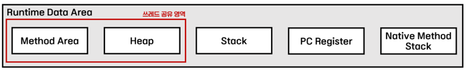

运行时数据区总共由五个区域组成。

- Method Area 方法区：上传类信息的区域。由所有线程共享
- Heap 堆：创建使用 new 关键字创建的实例的区域。由所有线程共享
- Stack 栈：存储局部变量、参数、返回值等临时使用的值的区域。
- PC Register PC寄存器：存放当前线程执行部分的地址和指令的区域
- Native Method Stack 本机方法堆栈：执行用本机语言编写的代码的区域

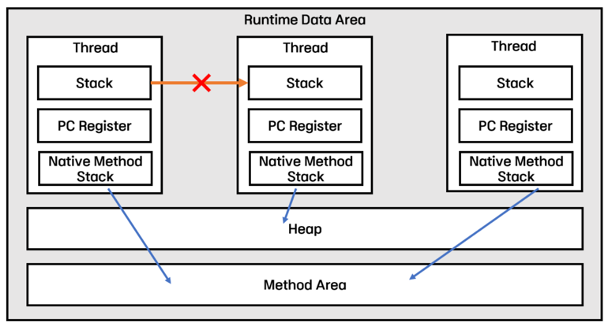

如上图所示，Runtime Data Area的Stack、PC Register、Native Method Stack是每次创建线程时都会新建并分配给线程的，而Method Area和Heap是在JVM启动时分配并共享的由所有线程。 此时，由于每个线程都无法侵入分配给其他线程的内存区域，因此在编写代码时无需考虑局部变量的并发问题。

### Method Area 方法区

***这是上传有关类的信息并由所有线程共享的区域。静态区。***

当程序执行过程中使用类或接口时，JVM会请求ClassLoader将类和接口的元数据存储在方法区中。

由于该区域中存在类的信息，因此创建实例时必须引用方法区，因此所有线程共享该区域。

方法区中存储的元数据如下。

1. 类型信息：有关类和接口的信息
    - 类型名称（符号引用）：类的名称，包括包名称。
    - 类型：类或接口
    - 类型控制器：访问控制器（公共、私有等）和其他控制器（抽象、最终等）
    - 相关接口信息：类中使用的接口信息
2. 运行时常量池：存储类型常量信息的池。可通过索引访问
    - 存储对类和接口常量、方法和字段的所有引用。
    - 在JVM中，引用它来查找相应方法和字段的实际内存地址。
    - 当类信息上传到方法区时，会创建一个指向常量池的指针，以便可以随时访问类内的常量。
3. 字段信息：存储实例变量的信息。
    - 类型名称：实例变量的类型
    - 类型控制器：访问控制器（公共、私有等）和其他控制器（抽象、最终等）
4. 方法信息：保存有关方法的所有信息。
    - 方法名称
    - 方法返回类型
    - 方法参数个数以及每个参数的类型信息
    - 有关所需方法的信息
5. 类变量：存储用 static 关键字声明的变量。

***也就是说，类的所有信息都以字节码的形式加载到方法区中。***

### Heap 堆

***这是一个存储使用new 关键字动态创建的实例对象的区域，由所有线程共享，并且是一个受垃圾回收的区域。***

程序执行时动态创建的实例存储在堆中，它们的引用存储在堆栈中。换句话说，可以通过堆栈中存储的引用来访问堆区域中的实例。

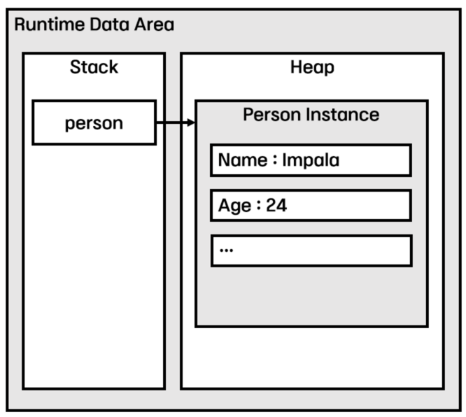

如果堆区域已满，则会发生***OutOfMemoryError***。

另外，JVM为了高效的内存区域管理而进行垃圾收集，而堆区域就是垃圾收集的目标。

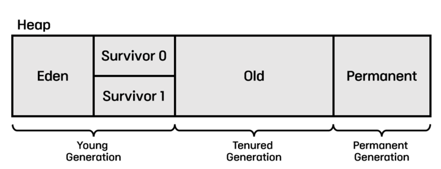

堆区域主要分为三个区域，以实现高效的垃圾收集。

1. Young(New) Generation 年轻代
    - 当使用new关键字创建一个新实例时，它会被存储在Eden区中，然后移动到Servovor中。
    - 随着时间的推移，该区域的数据会根据优先级被移动到旧区域或者被GC回收（Minor GC）。
2. Tenured(Old) 老年代
    - 移动和存储年轻代区域中存储的较旧对象实例的区域。
    - 如果分配给old区域的内存超过允许的限制，则检查old区域中的所有实例，并一次性删除未引用的实例（Major GC）。
    - 当发生Major GC时，除了执行GC的线程之外的所有线程都停止工作（Stop-the-World）。
3. Permanent Generation 永久代
    - ClassLoader动态加载的类的元数据存放区域
    - Java 8之后被Metaspace取代并排除在堆区域之外。

### Stack 栈

***这是存储临时使用的值（例如局部变量、方法参数和返回值）的区域，并在创建线程时与 PC 寄存器和本机方法堆栈一起分配。***

当程序执行过程中执行到一个方法时，JVM会将该方法的帧压入栈区并暂时存储数据。当方法结束时，该方法的帧从堆栈中弹出。

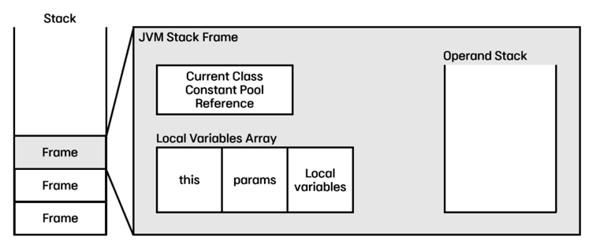

Frame是Stack的基本数据结构，由以下三个元素组成。

1. 常量池参考：方法区运行时常量池的参考
   - 它有一个对运行时常量池的引用，以使用该方法所属类的常量。
2. 局部变量数组：方法中包含局部变量的数组
    - 第一个索引存储对当前实例（this）的引用
    - 从第二个索引开始，值按照参数->局部变量的顺序存储。
3. 操作数栈：存储计算过程中产生的操作数值和中间值。
   - JVM 执行基于堆栈的操作。
   - 因此，由于计算所需的所有操作数都存储在堆栈中，因此与通用汇编语言不同，无需指定操作数即可对字节码进行操作。
   - 与其他汇编语言不同，不使用寄存器进行计算的原因是每个设备的寄存器数量不同，因此无法假设数量。为了尽量减少硬件的参与，JVM即使计算过程很复杂也使用堆栈复杂的

如果线程超出可用堆栈大小，则会发生***StackOverflowError***。另外，当没有足够的内存来动态扩展堆栈或者创建新线程时没有足够的内存可以分配给堆栈时，就会发生***OutOfMemoryError***。

### PC Register PC寄存器

***Stack，Native Method 这是在创建线程时与Stack一起分配给每个线程的区域，存储当前正在执行的JVM的命令的地址。***

由于JVM是以Stack-Base方式运行的，它从Stack中取出Operand，存放在单独的内存空间中，然后进行计算，此时使用的内存空间就是PC Register。

在多线程编程环境中，当一个线程正在工作并将CPU资源传递给另一个线程并再次接收时，会记录当前正在执行的指令的地址以便继续工作。

如果线程正在执行 JVM 指令，则它具有该指令的地址，但如果它正在执行本机方法，则 PC 寄存器保持未定义状态，并且本机方法堆栈负责处理此状态。

### Native Method Stack

***用于执行用本机语言（C/C++、汇编）编写的代码的内存区域***

- 为Java以外的语言在JVM中运行而分配的内存区域，一般采用C栈。
- 当在线程中执行使用本机方法而不是 Java 方法的方法时，有关该方法的信息将存储在此处。
- 可以通过JNI（Java Native Interface）以接近标准的方式实现。

### 堆栈的异常总结

(1)堆内存溢出OutOfMemoryError:java heap space

产生原因：java堆用于存储对象实例，只要不断的创建对象，并保证GC roots到对象间有可达路径避免这些对象的GC，那么，当对象数量到达堆的最大容量限制后就会产生OOM。

解决办法：

1. 通过参数 ***-XX:HeapDumpOnOutOfMemoryError*** 可以让虚拟机在内存溢出异常时Dump当前内存堆转储快照
2. 通过内存映像分析工具（如：Eclipse Memory Analyzer）对Dump出的堆转储快照分析，判断是内存泄露还是内存溢出
3. 如果是内存泄露：通过工具查看泄露对象的类型信息和它们到 GC Roots 的引用链信息，分析GC收集器无法自动回收它们的原因，定位内存泄露的代码位置
4. 如果是内存溢出：检查堆参数 -Xms和-Xmx，看是否可调大；代码上检查某些对象生命周期过长，持有时间过长的情况，尝试减少程序运行期间内存消耗

(2)除程序计数器外，JVM其他几个运行时区域都可能发生OutOfMemoryError异常

(3)栈的两种异常

1. StackOverFlowError异常：线程请求的栈深度大于虚拟机所允许的最大深度, 一个会发生stackOverFlow的场景：无限递归，没有出口
2. OutOfMemoryError异常：虚拟机扩展栈时无法申请足够的内存空间 一个会发生OutOfMemory的场景：list，无限添加元素

解决虚拟机栈两种异常的办法：

1. 检查代码中是否有死递归。
2. 配置 -Xss 增大每个线程的栈内存容量，但会减少工作线程数，需要权衡。

### 常用的JVM参数设置

(1)-Xss，设置栈的大小，不熟悉最好使用默认值，当栈中存储数据比较多时，需要适当调大这个值，否则会出现java.lang.StackOverflowError异常

(2) 堆内存设置：
1. -Xms，初始堆大小，Server端JVM最好将-Xms和-Xmx设为相同值，开发测试机JVM可以保留默认值
2. -Xmx，最大堆大小，默认为物理内存的1/4，最佳设值应该视物理内存大小及计算机内其他内存开销而定
默认空余堆内存小于 40%时，JVM就会增大堆直到-Xmx的最大限制；空余堆内存大于70%时，JVM会减少堆直到-Xms的最小限制。因此服务器一般设置-Xms、-Xmx相等以避免在每次GC后调整堆的大小。
3. -Xmn:年轻代大小(young区大小)，通常为 Xmx 的 1/3 或 1/4，不熟悉最好保留默认值
4. -XX:SurvivorRatio，设置年轻代Eden和单个S区的比例，默认为8，即Eden为8/10，两个survivor分别为1/10，其中一个survivor闲置，用于复制，所以年轻代实际可用的内存大小为-Xmn设置值的9/10，Eden设置的太大的话，会导致GC变慢，并且没有足够的survivor幸存者空间，会导致GC直接到达老年代，老年代满的更快，会更早触发FullfGC，Eden设置的过小，则MinorGC频繁，会影响线上程序运行，因为GC会导致应用程序暂停。
5. -XX:MaxTenuringThreshold，设置年轻代中回收区对象的年龄，默认15，可通过命令指定，如果设置为0，表示Eden回收时，不经过Survivor，直接到达老年代。

(3) 持久代设置：
1. -XX:PermSize，方法区(永久代，或称非堆区)初始分配的内存大小，其全称为permanent size(持久化内存)
2. -XX:MaxPermSize=64m，永久代的最大大小，超过这个值，将会抛出OutOfMemoryError:PermGen
在配置之前一定要慎重的考虑一下自身软件所需要的非堆区内存大小，因为持久代内存是不会被java垃圾回收机制进行处理的地方。
最大堆内存与最大非堆内存的和绝对不能够超出操作系统的可用内存。

(4) 元空间的设置：

JDK 1.8 的时候，方法区(HotSpot 的永久代)被彻底移除了(JDK1.7 就已经开始 了)，取而代之是元空间，元空间使用的是直接内存。配置如下：

-XX:MetaspaceSize=N //设置 Metaspace 的初始（和最小大小）

-XX:MaxMetaspaceSize=N //设置 Metaspace 的最大大小

与永久代很大的不同就是，元空间解决了永久代易发生内存溢出的问题，但是要注意，如果不指定元空间的大小，随着更多类的创建，虚拟机会耗尽所有可用的系统内存。

### GC的回收过程

1. MinorGC的过程：MinorGC采用复制算法，首先，把Eden区域和使用的幸存者区域(SurvivorFrom)中存活的对象复制到另一块空闲的幸存者区(SurvivorTo)中，同时，把这些对象的年龄+1，如果有对象的年龄已经达到了老年代的标准，则赋值到老年代区，如果空闲的幸存者区(SurvivorTo)不够存放Eden和使用的幸存者区(SurvivorFrom)移动过来的数据，则直接放到老年代，然后，清空Eden和使用的幸存者区中(SurvivorFrom)的对象，然后，幸存者区互换，SurvivorTo中的数据换到SurvivorFrom中，SurvivorFrom继续等待下一次GC，Survivor区每熬过一次MinorGC，就将对象的年龄+1，当对象的年龄到达某个值时(默认时15，可用通过参数-XX:MaxTenuringThreshold 来设定)，这些对象就会成为老年代。
2. MajorGC的过程：老年代的回收，不会那么频繁，老年代使用的回收算法是标记-清除或标记-整理算法，标记-清除算法会产生内存碎片，即不连续的空间，如果此时，有大的对象进来，内存中没有足够的连续空间时，会提前触发FullGC(这是一个优化点)，一次FullGC的时间要比一次MinorGC的时间长，当年老代也装不下，就会抛出OOM(Out Of Memory)异常　　
3. Full GC触发的过程：老年代满了而无法容纳更多的对象，会触发Full GC，Full GC 清理整个内存堆，包括年轻代和老年代。

### Garbage collection algorithm GC算法

1. Mark-Sweep 标记-清除
   (1) 标记-清除算法，缺点是容易产生碎片，且效率不高，标记过程和清除过程效率都不高
    标记-清除算法的过程，分为两个过程，标记过程和清除过程
    ① 标记过程，遍历所有的GC-roots，然后将所有GC-roots可达的对象标记为存活的对象(记为1)
    ② 清除过程，遍历堆中的所有对象，将没有标记的对象全部清除掉(没有标记过的，记为0)
    ③ 清除过后，被标记过的对象留下，标志位重新归0

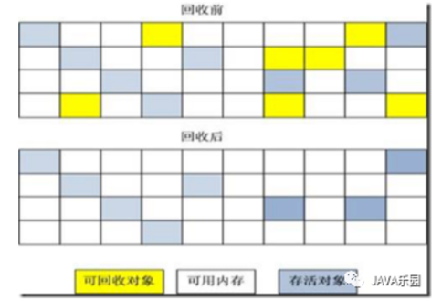
2. Copying 复制
   复制算法的过程，就是把内存分为2块等同大小的内存空间(A和B)，使用A进行内存的使用，当A内存不足以分配对象而引起内存回收时，就会把存活的对象从A内存块放到B内存块，
   然后把A内存块中的对象全部清除掉，然后在B内存块中使用，当B内存不足以分配对象而引起内存回收时，就会把存活的对象从B内存块放到A内存块中，然后把B内存块中的对象全
   部清除掉，如此循环复制算法的好处是，避免的空间碎片(内存中不连续的空间)，缺点是浪费了一半的空间，降低空间使用

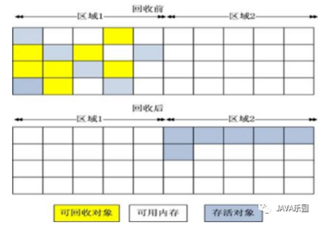
3. Mark-Compact 标记-整理算法
   标记-整理算法的过程，标记过程仍然与标记-清除算法一样，但后续步骤不是直接 对可回收对象进行清理，而是让所有存活的对象都向一端移动，然后直接清理掉端边界以外的内存

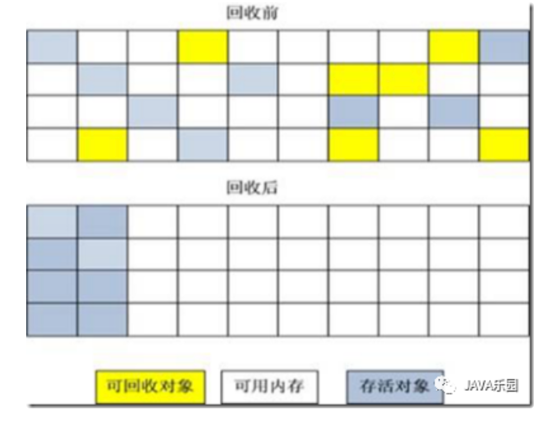
4. Generational Collection 分代收集算法
   VM实际GC中使用的，根据对象存活周期的不同，分新生代和老年代，新生代使用复制算法，因为每次GC只有少量的对象存活，用复制算法只需要付出少量存活对象的复制成本就可以
   完成收集， 老年代使用标记-整理算法或标记-清除算法，老年代中，对象存活率高，没有额外的担保空间，就必须使用标记-清除或标记-整理算法

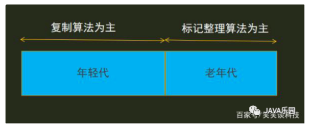

### GC的回收器(JDK 18 中的 OpenJDK GC)

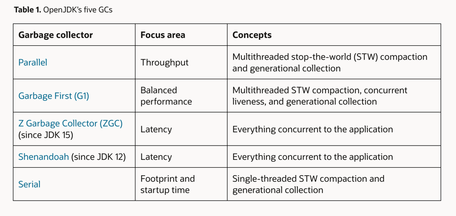

1. Parallel (< Java8)

    并行 GC 是 JDK 8 及更早版本的默认收集器。它尝试以更紧凑的形式将对象从堆中的一个位置复制到另一个位置，以便我们可以在内存中拥有更多空间。有一个概念称为“停止世界”(STW) 暂停。当有新的请求等待，并且由于堆没有任何空间而没有可分配的内存时，会触发 STW 暂停。在这种情况下，JVM 将完全停止应用程序，并专注于运行 GC 算法，所有线程和进程都专用于 GC。一旦Heap中的空间被清理干净，JVM就会为请求的对象分配空间，并最终继续执行应用程序。该算法通过尝试在一个时间单位内完成更多工作来关注吞吐量，同时尽量减少对延迟（暂停）的关注。它使用多线程来完成工作，并且通常需要更长的暂停时间，因为它注重吞吐量。每次暂停的时间都会更长，并且在这些较长的暂停期间会收集垃圾。因此，延迟会受到影响，因为应用程序请求必须在这些暂停期间等待。
    
    通过对 JVM 使用以下命令或在 JVM 启动脚本中使用它，可以选择并行 GC 作为默认 GC 算法：

        java -XX:+UseParallelGC com.mypackages.MyExecutableClass
        java -XX:+UseParallelOldGC com.mypackages.MyExecutableClass
        java -XX:+UseParallelGC -XX:+UseParallelOldGC com.mypackages.MyExecutableClass

2. Garbage First (> Java9)

   G1 GC 是 Java9 及更高版本中使用的默认算法。 G1 同样关注吞吐量和延迟。
   Stop the World 概念 -基本上是暂停应用程序一段时间，以便垃圾收集可以工作。该算法使用“停止世界”(STW) 暂停，但使暂停更短，以便可以减少延迟，即请求/操作不必等待更长时间才能完成。
   缩短暂停时间意味着 GC 算法的工作时间非常短，以便应用程序可以顺利运行，而最终用户不会注意到这些暂停。

   G1 与应用程序并发执行这项冗长的工作，即在应用程序使用多个线程运行时。这显着减少了最大暂停时间，但代价是一些整体吞吐量。

   这个G1算法很稳定，非常成熟，并且一直在升级，有更新的想法。您可以请求此算法中的 stop-the-world 暂停时间不超过 x 毫秒。 G1 的关键设计目标之一是使由于垃圾收集而导致的停止世界暂停的持续时间和分布可预测和可配置。分代垃圾收集在切换该角色的两个性能指标（吞吐量和延迟）方面发挥着关键作用。 G1 的作用是，它将堆内存分为 2 部分：1. 年轻代 (Young Generation) 2. 老年代 (Old Generation)。分配给 Old 代的内存空间比 Young 代要多得多。活动时间较长的对象会从年轻代移动到老生代，即当一个对象在一定次数的 GC 中幸存下来时，收集器会将其移动到老生代。较新的对象最初分配给年轻内存。这意味着年轻代中拥有临时或短命对象的概率更高。说得通 ？因为长期以来一直处于活动状态的所有对象都将驻留在旧的内存位置中。因此，每当 G1 垃圾收集运行时，检查年轻代内存是合乎逻辑的。因此，我们将从年轻内存中释放空间，并且该空间可以分配给新的请求和操作。

   然而，老一代内存最终会被填满。为了解决这个问题，G1 GC 算法使用分代垃圾收集，这意味着它会检查完整的年轻代内存以进行 GC，但对老一代内存使用增量方法。由于老一代内存会包含更多的活动对象（当前正在被应用程序使用），因此如果没有分代垃圾收集的概念，针对该内存的 GC 所花费的时间会相对较长。

3. Z Garbage collector (JDK15)
4. Shenandoah (JDK12)

   ZGC 和 Shenandoah GC更喜欢通过补偿吞吐量来将延迟作为目标。他们尝试在没有明显停顿的情况下完成所有垃圾收集工作。它们首先分别作为非实验版本在 JDK 15 和 JDK 12 中引入

5. Serial

   Serial GC顾名思义是串行的，也就是说它只使用 1 个线程来完成 STW（Stop The World）工作。它无法利用多处理器硬件。该 GC 算法可用于小型、短时间运行的应用程序，因为它方法简单且没有复杂性规则。 Java5 和 Java6 使用了该算法。

### JVM的优化
### JVM的内存分析工具 

1. jprofiler
2. Arthas
3. JVM自带的内存分析小工具: jconsole、jhat、jmap、jstack、jstat、jstatd、jvisualvm
4. Linux工具: pidstat、vmstat、iostat

(1) jconsole，jvm自带内存分析工具,位于jdk的bin目录下，它提供了图形界面。可以查看到被监控的jvm的内存信息，线程信息，类加载信息，MBean信息。

(2) jhat，jvm自带内存分析工具,位于jdk的bin目录下，jdk6+版本自带，能够分析dump文件，执行 jhat -J -Xmx512m [file] ，file就是dump文件路径。

(3) jmap，jvm自带内存分析工具,位于jdk的bin目录下，倾向于分析jvm内存中对象信息，jmap -histo <pid>在屏幕上显示出指定pid的jvm内存状况，太简单。

jmap -dump:file=c:\dump.txt 340  导出dump文件，用专门的dump分析工具分析。

(4) jstack，jvm自带内存分析工具,位于jdk的bin目录下，会显示线程优先级，线程ID，native线程ID，线程栈起始地址

(5) jstat，jvm自带内存分析工具，位于jdk的bin目录下，倾向于分析jvm内存的gc情况，常用参数-gcutil，这个参数的作用不断的显示当前指定的jvm内存的垃圾收集的信息。 jstat -gcutil 340 10000，这个命令是每个10秒钟输出一次jvm的gc信息，10000指的是间隔时间为10000毫秒。

(6) jstatd，jvm自带内存分析工具,位于jdk的bin目录下，一个RMI的server，它可以监控Hotspot的JVM的启动和结束，同时提供接口可以让远程机器连接到JVM。比如 jps  jstat都可以通过jstatd来远程观察JVM的运行情况。

(7) jvisualvm，jvm自带内存分析工具,位于jdk的bin目录下，JDK6 update 7之后推出，,java可视化虚拟机，它不但提供了jconsole类似的功能，还提供了jvm内存和cpu实时诊断，还有手动dump出jvm内存情况，手动执行gc。和jconsole一样，运行jviusalvm，在jdk的bin目录下执行jvisualvm，windows下是jvisualvm.exe,linux和unix下是jvisualvm.sh。

(8) pidstat，linux系统下使用，需要安装，yum install sysstat，要查看Linux下面进程、进程组、线程的资源消耗的统计信息，可以使用pidstat，它可以收集并报告进程的统计信息。

(9) vmstat，linux系统下使用，需要安装，vmstat是Virtual Meomory Statistics（虚拟内存统计）的缩写，可对操作系统的虚拟内存、进程、CPU活动进行监控。是对系统的整体情况进行统计，不足之处是无法对某个进程进行深入分析。

(10) iostat，linux系统下使用，需要安装，yum install sysstat，iostat是I/O statistics（输入/输出统计）的缩写，iostat工具将对系统的磁盘操作活动进行监视。它的特点是汇报磁盘活动统计情况，同时也会汇报出CPU使用情况。iostat也有一个弱点，就是它不能对某个进程进行深入分析，仅对系统的整体情况进行分析

(11) MAT，可以通过MAT分析内存泄漏的原因

### 对象的创建

在语言层面，创建对象有四种方式：1) clone 2)反序列化 3)反射 4) New

而在虚拟机中，对象创建的过程是如何呢？

JAVA编译解释的过程：.java文件->javac编译成.class字节码文件->jvm解释执行。

Java很特殊，Java程序需要编译但是没有直接编译成机器语言，即二进制语言，而是编译成字节码（.class）再用解释方式执行。java程序编译以后的class属于中间代码，并不是可执行程序exe，不是二进制文件，所以在执行的时候需要一个中介来解释中间代码，这既是java解释器，也就是所谓的java虚拟机（JVM），也叫JDK。

JVM中，对象创建过程(New)分三步：1) 类加载 2) 为新对象分配内存 3)初始化

在虚拟机遇到new指令时：

1) 类加载：确保常量池中存放的时已解释的类，且对象所属类型已经初始化过，如果没有，则先执行类加载

2) 为新生对象分配内存：对象所需内存大小在类加载时可以确定，将确定大小的内存从Java堆中划分出来

- 分配空闲内存方法：
 - - 指针碰撞：假如堆是规整的，用过的内存和空闲的内存各一边，中间使用指针作为分界点，分配内存时将指针移动对象大小的距离
 - - 空闲列表：假如堆是不规整的，虚拟机需要维护哪些内存块是可用的列表，分配时候从列表中找出足够大的空闲内存划分，并更新列表记录
- 对象创建在并发情况下保证线程安全：例如，正在给对象A分配内存，指针还没修改，对象B同时使用了原来的指针来分配内存
 - - CAS配上失败重试
 - - 本地线程分配缓冲TLAB(ThreadLocal Allocation Buffer)：将内存分配动作按线程划分到不同空间中进行，即每个线程在Java堆中预先分配一块内存

3) 将分配的内存空间初始化为零值：保证对象的实例在Java代码中可以不赋值就可  直接使用，能访问到这些字段的数据类型对应的零值（例如，int类型参数默认为0）

4) 设置对象头：设置对象的类的元数据信息、哈希码、GC分代年龄等

5) 执行<init>方法初始化：将对象按照程序员的意愿初始化

### 对象的内存布局

在HotSpot虚拟机中，对象在内存中存储的布局分为3个区域，如下图：

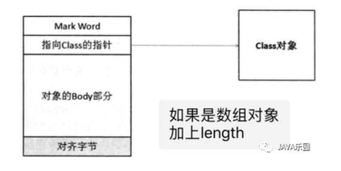

（1）对象头(Header)：

i. MarkWord：存储对象自身的运行时数据，例如：哈希码HashCode、GC分代年龄、锁状态标志、线程持有的锁、偏向线程ID等。考虑空间效率，Mark设计为非固定的数据结构，它根据对象的不同状态复用自己的空间，如下表格：

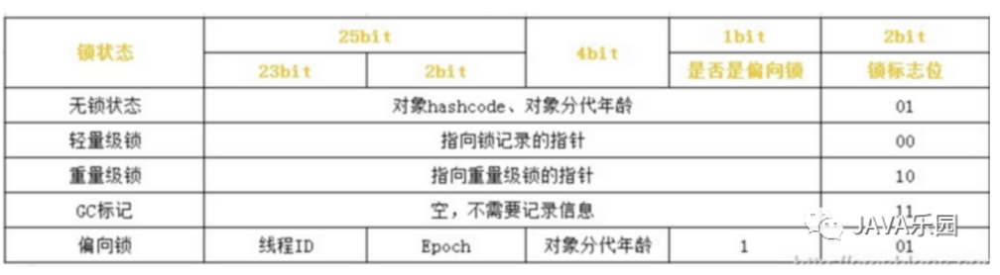

ii. 指向Class的指针：即对象指向它的类的元数据的指针，虚拟机通过这个指针来确定是哪个类的实例

iii. 如果对象是Java数组，对象头中还需要一块记录数组长度的数据

### 类加载器、反射、双亲委派

(1)类加载器，其作用就是，负责将class文件加载到内存中

java中，先通过javac将java文件编译为class文件， 然后使用ClassLoader类加载器加载class文件到内存中，当一个类被使用时，就会加载到内存中，类加载的过程包括：加载，验证，准备，初始化

(2) 双亲委派模型

每一个类都有一个相对应的类加载器，系统中的ClassLoader在协同工作会默认使用双亲委派模型，类加载的过程，是从父类到子类，类验证的过程，是从子类到父类，也就是说，加载的时候，首先把该类委派给该父类加载器的loadClass()处理，因此所有的请求最终都应该传送到顶层的启动类加载器BootstrapClassLoader中，然后验证，即在类加载的时候，系统就会首先判断当前类是否被加载过，如果已经加载的类会直接返回，否则都会尝试加载，即当父类加载器无法处理时，都由自己来处理，当父类加载器为null时，会使用启动类加载器BoostrapClassLoader作为父类加载器。

双亲委派保证了java程序的稳定运行，避免了类的重复加载。

除了BootstrapClassLoaderader其他类加载器均由Java实现且全部继承于java.lang.ClassLoader，如果要自定义类加载器，就要继承ClassLoader。

(3)反射

反射是把.class文件加载进内存，把.class中的所有内容，封装成 一个一个的对象的过程，在 程序中可以通过这些对象动态的完成方法的调用，成员变量的赋值，对象的创建！

反射获取Class对象的三种方式：

i、Class.forName(全类名)

ii、类名.class

iii、对象名.getClass();

