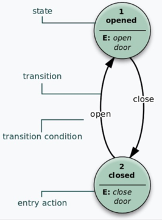

>
>
> Reference: https://juejin.cn/post/6844904170852450318 https://segmentfault.com/a/1190000009906317
>
有限状态机（英语：finite-state machine，缩写：FSM）又称有限状态自动机，简称状态机，是表示有限个状态以及在这些状态之间的转移和动作等行为的数学模型。

状态存储关于过去的信息，就是说：它反映从系统开始到现在时刻的输入变化。转移指示状态变更，并且用必须满足确使转移发生的条件来描述它。动作是在给定时刻要进行的活动的描述。有多种类型的动作：

状态机有四个核心概念，这是所有状态机的基础

- State ，状态。一个状态机至少要包含两个状态。
- Event ，事件。事件就是执行某个操作的触发条件或者口令。“借书”就是一个事件。
- Action ，动作。事件发生以后要执行动作。例如事件是“借书”，动作是“借”。编程的时候，一个 Action 一般就对应一个函数。 动作是在给定时刻要进行的活动的描述。有多种类型的动作：
  - 进入动作（entry action）：在进入状态时进行
  - 退出动作：在退出状态时进行
  - 输入动作：依赖于当前状态和输入条件进行
  - 转移动作：在进行特定转移时进行
- Transition ，过渡。也就是从一个状态变化为另一个状态。

对状态机输入一个事件，状态机会根据当前状态和触发的事件唯一确定一个状态迁移。

从形式上讲，有限状态机是一个五元机(𝜮、𝑺、𝑺o、𝜹、𝑭)，其中。

- 𝜮是一个输入动作字母表。
- 𝑺是一组可能的状态。
- 𝑺o是初始状态。
- 𝜹是一个状态转换函数𝜹 :𝑺 x 𝜮 → 𝑺（从字母表输入后，从一个状态过渡到另一个状态）。
- 𝑭是一组结束状态。

FSM（有限状态机）可以使用上图那样的状态图（或状态转移图）来表示。此外可以使用多种类型的状态转移表。下面展示最常见的表示：当前状态（B）和条件（Y）的组合指示出下一个状态（C）。完整的动作信息可以只使用脚注来增加。包括完整动作信息的FSM定义可以使用状态表。

状态图的基本概念2
状态图（Statechart Diagram）主要用于描述一个对象在其生存期间的动态行为，表现为一个对象所经历的状态序列，引起状态转移的事件（Event），以及因状态转移而伴随的动作（Action）。一般可以用状态机对一个对象的生命周期建模，状态图用于显示状态机（State Machine Diagram），重点在与描述状态图的控制流。

状态图有以下几类元素构成：

- 状态（States）
- 转移（Transitions）
- 动作（State Actions）
- 自身转移（Self-Transitions）
- 组合状态（Compound States）
- 进入节点（Entry Point）
- 退出节点（Exit Point）
- 历史状态（History States）
- 并发区域（Concurrent Regions）
- 警备条件（Guard condition）

## 开源的状态机实现
状态机是上述对状态图定义的实现，下面几种实现遵循基本的定义，但实现的完善度不尽相同。学习时Demo放在GitHub上，需要可取。

### spring-statemachine
spring-statemachine的优点官网中介绍的很清楚，不赘述，但在简单看了介绍和实现后基本就放弃了，原因如下：

- 天生依赖spring，目前最新版本的依赖到Spring框架5.0.X，而我需要引入状态机的工程目前还停留在4.2.X。
- 状态机实例较重，在官方文档给出的Demo中，推荐注解的形式注入状态机，这样难以随用随new。
- 关于上一点，其给出了采用工厂的方式解决，但根据单据的业务场景来看，缓存这些实例意义并不大。

### squirrel-foundation

特点

1. 代码量适中，扩展和维护相对而言比较容易
2. StateMachine轻量
   StateMachine实例创建开销小，本身不支持单例复用，状态机的生命周期清晰
3. 切入点丰富
   支持exit、transition、entry基本动作，转换过程留有足够的切入点。

下面是一个状态转换的过程，可以看到我们有很多可以切入的点来记录或者改变状态机的行为。比较蛋疼的是，在状态机初始化时，squirrel把初始化状态当作一个事件发布，导致会多出来一个相应的事件记录。

    //第一行为初始化状态机为OffHook时，注册事件处理器所打印
    15:59:09.570 [main] WARN com.cxd.squirrel.StateMachineSquirrel - Entry State OffHook
    //以下是一个完整的状态转换过程
    15:59:09.574 [main] WARN com.cxd.squirrel.StateMachineSquirrel - beforeTransitionBegin
    15:59:09.581 [main] WARN com.cxd.squirrel.MyCondition - 自定义转换条件 isSatisfied MyContext{no='yes'}
    15:59:09.581 [main] WARN com.cxd.squirrel.StateMachineSquirrel - beforeActionInvoked
    15:59:09.581 [main] WARN com.cxd.squirrel.StateMachineSquirrel - exit State OffHook
    15:59:09.581 [main] WARN com.cxd.squirrel.StateMachineSquirrel - afterActionInvoked
    15:59:09.582 [main] WARN com.cxd.squirrel.StateMachineSquirrel - beforeActionInvoked
    15:59:09.582 [main] WARN com.cxd.squirrel.StateMachineSquirrel - callMethod Transition...
    15:59:11.586 [main] WARN com.cxd.squirrel.StateMachineSquirrel - afterActionInvoked
    15:59:11.587 [main] WARN com.cxd.squirrel.StateMachineSquirrel - Entry State Ringing
    15:59:11.588 [main] WARN com.cxd.squirrel.StateMachineSquirrel - afterTransitionCompleted
    15:59:11.589 [main] WARN com.cxd.squirrel.StateMachineSquirrel - afterTransitionEnd

4. 支持异步

事件处理机制上squirrel和Spring-statemachine比较相似，将事件处理与产生分离，使用deque交互，通过这种方式可以支持异步，采用生产-消费的方式，让线程责任更加明确。

在我们的业务场景中所有关于单据状态流转的操作都是用户通过移动端发起，需要同步响应操作结果，所以异步在我的场景中不适用。

鸡肋

1. 过于便利的设计
   squirrel在设计上为了足够的便利，在注册事件处理方法时通过传入方法名来实现，框架在处理时从状态机实现类中去找这些方法，通过动态的方式调用。
2. 框架的约定性太强

    方法名为transitFrom[SourceStateName]To[TargetStateName]On[EventName]，
    参数名为[MyState, MyState, MyEvent, MyContext]的方法会被添加到transition “A-(GoToB)->B”的action列表中。
    当状态机从’A’到’B’且触发的event为GoToB的时候，该方法会被调用。

3. 难以理解的异步处理方式
   看了下异步处理的过程，Spring-statemachine在把事件塞进队列后仅是提交了异步任务到Executor，业务线程便立刻返回，这和我理解的异步是一致的。
    
AbstractStateMachine#sendEventInternal
    
    private boolean sendEventInternal(Message<E> event) {
    //...省略...
    //此处是一个扩展，用户可自行加业务逻辑决定是否接受当前event
    boolean accepted = acceptEvent(event);
    //在此方法中创建了一个Runnable并提交到Executor
    stateMachineExecutor.execute();
    if (!accepted) {
    notifyEventNotAccepted(buildStateContext(Stage.EVENT_NOT_ACCEPTED, event, null, getRelayStateMachine(), getState(), null));
    }
    return accepted;
    }

而squirrel在把事件塞进队列后还需要等待消费线程消费完毕，不知道此时异步的意义体现在哪里。

另外所有的事件处理默认均有同一个线程来处理，如果用得到异步这种方式，请务必通过扩展方式定义自己的线程池。

squirrel有依赖较低版本Guava中被注解为@Beta的方法，使用时务必注意框架本身对其他开源工具的引用。

AbstractExecutionService#doExecute

    private void doExecute(String bucketName, List<ActionContext<T, S, E, C>> bucketActions) {
    final Map<ActionContext<T, S, E, C>, Future<?>> futures = Maps.newHashMap();
        for (int i=0, actionSize = bucketActions.size(); i<actionSize; ++i) {
            final ActionContext<T, S, E, C> actionContext = bucketActions.get(i);
            //...省略...
            Future<?> future = SquirrelConfiguration.getExecutor().submit(new Runnable() {
    
                public void run() {
                    StateMachineContext.set(instance, isTestEvent);
                    try {
                        actionContext.run();
                    } finally {
                        StateMachineContext.set(null);
                    }
                }
            });
            futures.put(actionContext, future);
            //...省略...
        }
        
        for(Entry<ActionContext<T, S, E, C>, Future<?>> entry : futures.entrySet()) {
            final Future<?> future = entry.getValue();
            final ActionContext<T, S, E, C> actionContext = entry.getKey();
            try {
                logger.debug("Waiting action \'"+actionContext.action.toString()+"\' to finish.");
                if(actionContext.action.timeout()>=0) {
                    future.get(actionContext.action.timeout(), TimeUnit.MILLISECONDS);
                } else {
                    future.get();
                }
                logger.debug("Action \'"+actionContext.action.toString()+"\' finished.");
            } catch (Exception e) {
                //...省略...
            }
        }
    }

### sateless4j

特点

1. sateless4j是C#版本FSM的Java实现，代码量很少，不到30个类。

2. StateMachine轻量，比squirrel创建实例代价还要小。

3. 支持基本的事件迁移，exit/entry action、guard、dynamic permit(根据自定义的condition来控制状态的迁移)。

